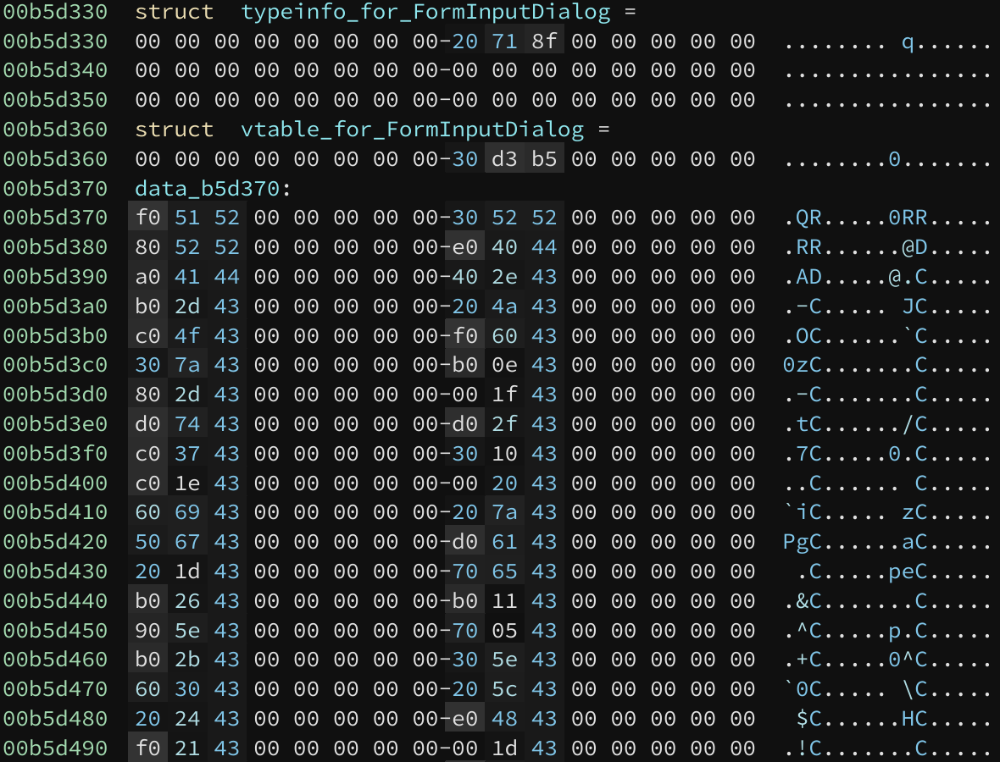
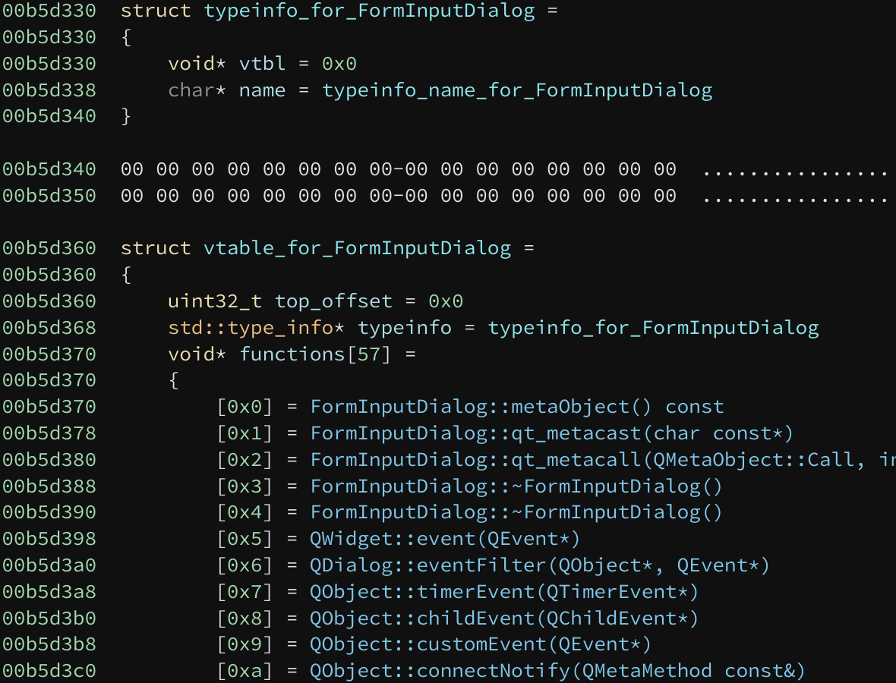

# Binary Ninja Itanium C++ ABI Plugin

The Itanium C++ ABI plugin provides an analysis that decodes RTTI and vtables, and discovers new procedures based on virtual function pointers.

## RTTI and vtable decoding

Before:

After:

## License

[0-clause BSD](LICENSE-0BSD.txt)
