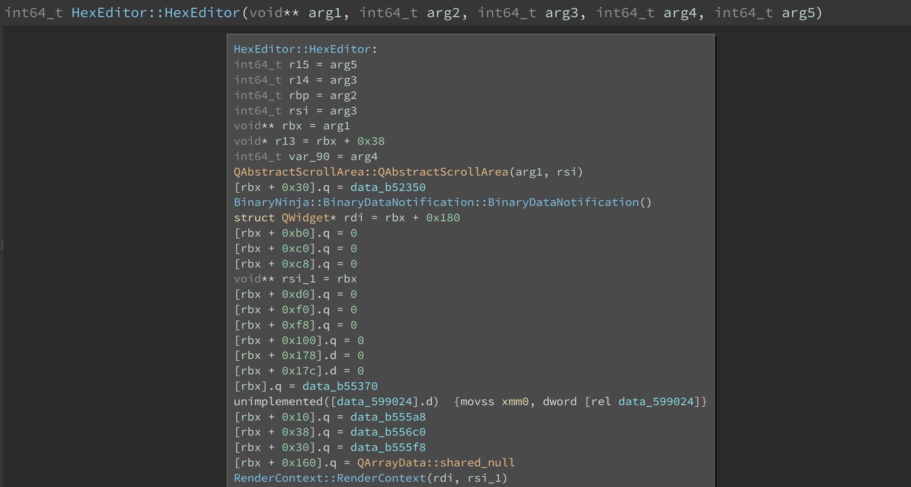
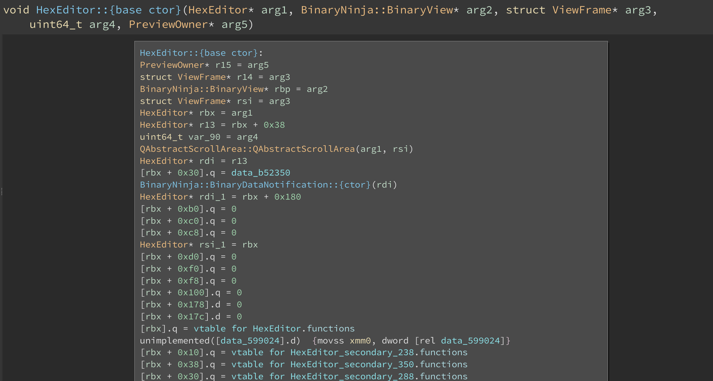

# Binary Ninja Itanium C++ ABI Plugin

The Itanium C++ ABI plugin provides a custom demangler, an analysis that decodes mangled names and updates function signatures, and an analysis that decodes RTTI and vtables and discovers new procedures based on virtual function pointers.

## Custom demangler

The custom demangler converts the mangled names into abstract syntax trees, allowing to extract more type information than the built-in one. For example, it differentiates between complete and base class constructors and destructors.

## Function signature decoding

Before / after:

 

Note that the decoding is necessarily heuristic as some information is lost, e.g. class members and standalone functions in a namespace have an exactly identical mangling. It is possible that the `this` argument (or worse) would be missing--consult the full decoded name of the function (`current_function.symbol.full_name`) to see the result of decoding, and apply your expertise.

## RTTI and vtable decoding

Before / after:

 

## License

[0-clause BSD](LICENSE-0BSD.txt)
